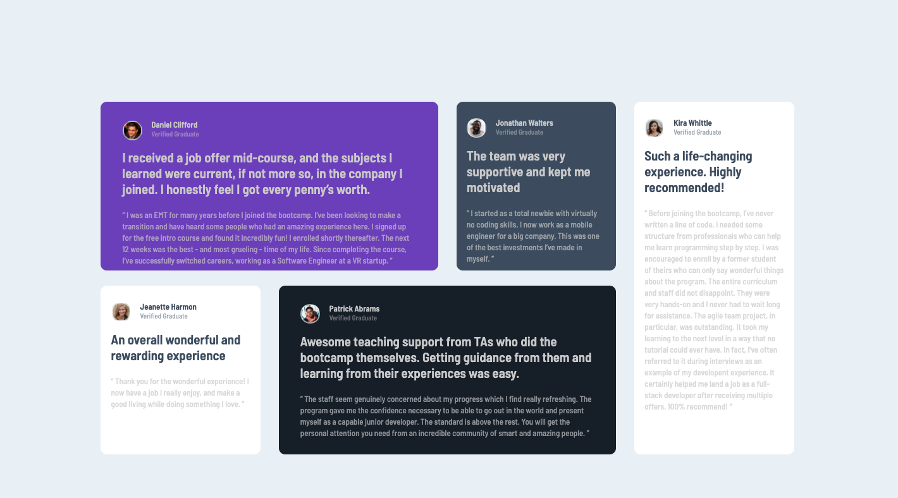

# Frontend Mentor - Testimonials grid section solution

This is a solution to the [Testimonials grid section challenge on Frontend Mentor](https://www.frontendmentor.io/challenges/testimonials-grid-section-Nnw6J7Un7). Frontend Mentor challenges help you improve your coding skills by building realistic projects. 

## Table of contents

- [Overview](#overview)
  - [The challenge](#the-challenge)
  - [Screenshot](#screenshot)
  - [Links](#links)
- [My process](#my-process)
  - [Built with](#built-with)
  - [What I learned](#what-i-learned)
  - [Continued development](#continued-development)
  - [Useful resources](#useful-resources)
- [Author](#author)
- [Acknowledgments](#acknowledgments)

## Overview

### The challenge

Users should be able to:

- View the optimal layout for the site depending on their device's screen size

### Screenshot




### Links

- Solution URL: [Portfolio](https://gelatodigital.com/portfolio)
- Live Site URL: [https://rodrigos-testimonial-grid.netlify.app/](https://rodrigos-testimonial-grid.netlify.app/)

## My process

### Built with

- Semantic HTML5 markup
- CSS custom properties
- Flexbox
- CSS Grid
- Mobile-first workflow

### What I learned

Use grid in a way that can work for a rezising screen, not just for what the mock-up looks like. Also, I can use other tabs to create lines on my screen, that makes "pixel perfect" much more achievable. At the same time, I was able to just give up pixel perfection and decide the project was DONE as soon as the dynamic design was working on acceptable capacity

To see how you can add code snippets, see below:

```css
    .main{
        display: grid;
        grid-template-columns: 1fr 1fr 1fr 1fr ;
        grid-template-rows: 1fr 1fr;
        grid-template-areas: 
        "daniel daniel jonathan kira"
        "jeanette patrick patrick kira";
        column-gap: 2vw;
        row-gap: 3vh;
        margin: 11.5% 11.1% 45%;
    }
```
This neat little trick also helps with Ipad size screens. Just attaching it at the end of the css makes the margins go away at "not big enough" screens
```css
@media screen and (min-width: 800px) and (max-width: 1200px){
    .main {
        margin: 1% 1%;
    }
}
```

### Continued development

I'm ready to tackle harder challenges. No reason to fear JS. Let's hope to keep the 1 challenge a day output going.

### Useful resources

- [1 stop shop for CSS grid](https://css-tricks.com/snippets/css/complete-guide-grid/)

## Author

- Website - [Rodrigo Barbosa](https://www.gelatodigital.com)
- Frontend Mentor - [@yRod-Barbosa](https://www.frontendmentor.io/profile/Rod-Barbosa)

## Acknowledgments

Thank you so much for Jonathan for reaching out. Talkin gto a future friend and employer and busines parter feels awesome!
